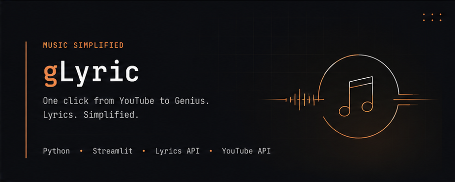
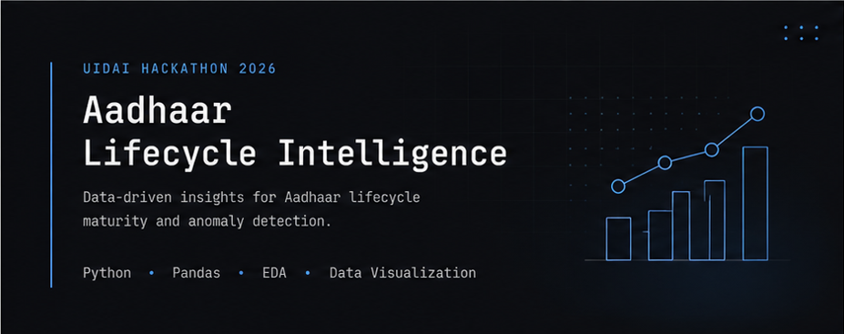
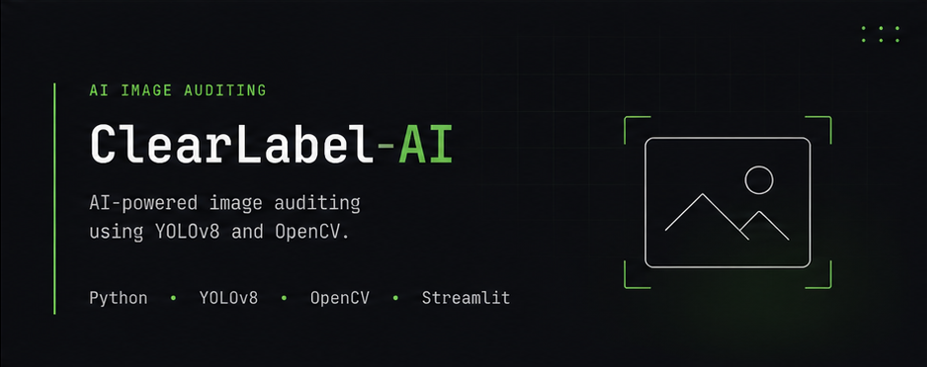

  

  

<table>
  <tr>
    <td width="60%" valign="top">

<h1>Hey, I'm Aawhan</h1>

Recent Computer Science graduate who's currently learning AI the only way I know how:
<b>building things until they finally work.</b>

Lately I've been spending most of my time experimenting with
<b>LLMs</b>,
<b>RAG</b>,
<b>Computer Vision</b>,
and whatever rabbit hole catches my attention next.

When I'm not writing Python, I'm probably making music, redesigning my portfolio for the 17th time, or convincing myself that adding "one more feature" is a good idea.

 

<h3 align="center">Let's connect.</h3>

  
  
  
  
  
  

</td>

<td width="40%" align="center" valign="top">

</tr>
</table>

 

<h2 align="center">🚀 Things I've Built</h2>

A collection of projects built while exploring AI, automation and developer tools.

<table width="100%">
<tr>

<td width="49%" valign="top">

<h3 style="margin:12px 0 6px 0;">
<a href="https://github.com/aawhan0/PuppetGPT" style="text-decoration:none;">
PuppetGPT
</a>
</h3>

Chat with your PDFs using Retrieval-Augmented Generation.

Python • LangChain • ChromaDB • Ollama

</td>

<td width="2%"></td>

<td width="49%" valign="top">

<h3 style="margin:12px 0 6px 0;">
<a href="https://github.com/aawhan0/gLyric" style="text-decoration:none;">
gLyric
</a>
</h3>

Instantly open song lyrics while browsing YouTube.

JavaScript • Chrome Extension • Python • Docker

</td>

</tr>

<tr>

<td width="49%" valign="top">

<h3 style="margin:12px 0 6px 0;">
<a href="https://github.com/aawhan0/aadhaar-lifecycle-intelligence" style="text-decoration:none;">
Aadhaar Lifecycle Intelligence
</a>
</h3>

District-level analytics and anomaly detection framework.

Python • Pandas • Data Visualization

</td>

<td width="2%"></td>

<td width="49%" valign="top">

<h3 style="margin:12px 0 6px 0;">
<a href="https://github.com/aawhan0/ClearLabel-AI" style="text-decoration:none;">
ClearLabel AI
</a>
</h3>

AI-assisted image annotation and quality auditing using YOLOv8.

Python • YOLOv8 • OpenCV

</td>

</tr>

</table>

 

<h2 align="center">💻 Tech Stack</h2>

 

<h2 align="center">📊 GitHub Statistics</h2>

<table align="center">
<tr>

<td align="center">

</td>

<td align="center">

</td>

</tr>

</table>

  <picture>
    <source media="(prefers-color-scheme: dark)" srcset="https://raw.githubusercontent.com/aawhan0/aawhan0/output/github-snake-dark.svg" />
    <source media="(prefers-color-scheme: light)" srcset="https://raw.githubusercontent.com/aawhan0/aawhan0/output/github-snake.svg" />
    
  </picture>

